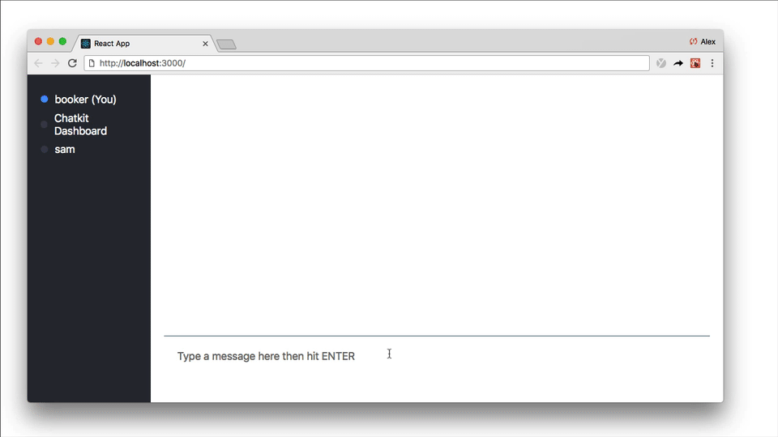
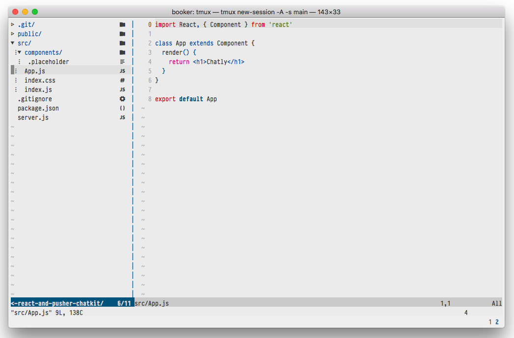
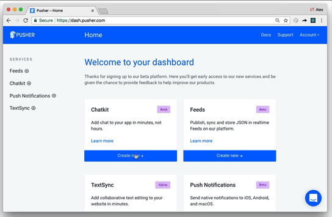
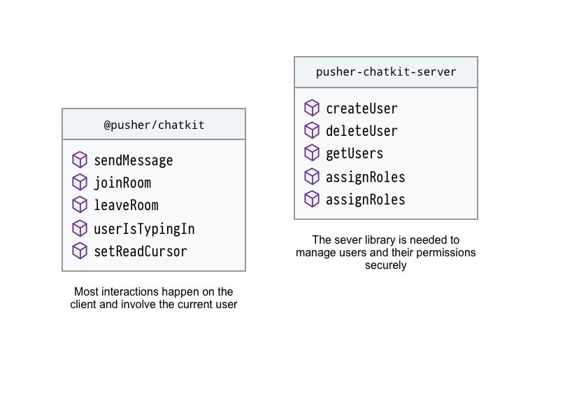
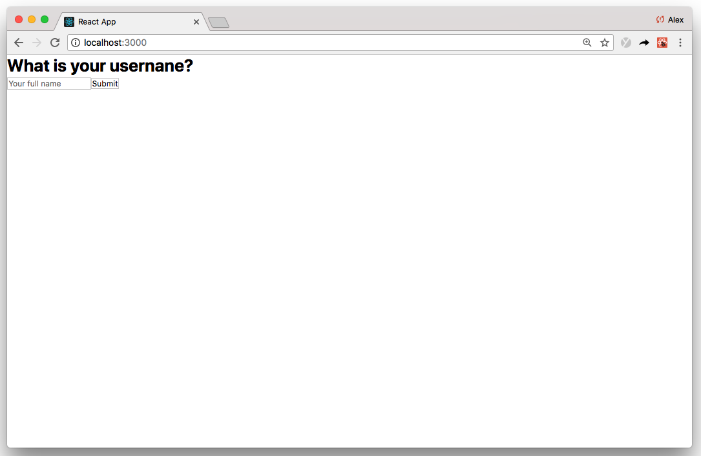
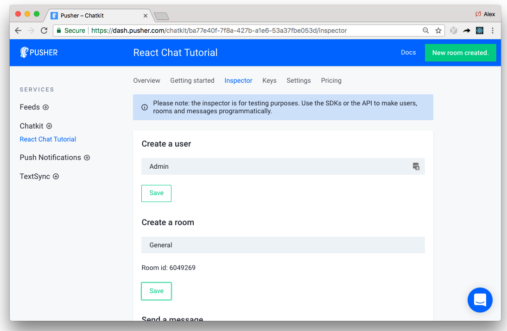
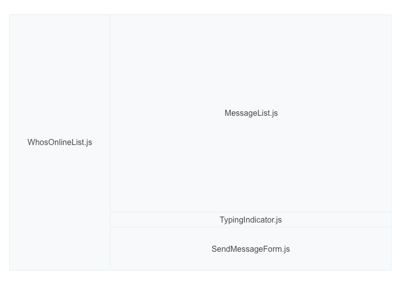
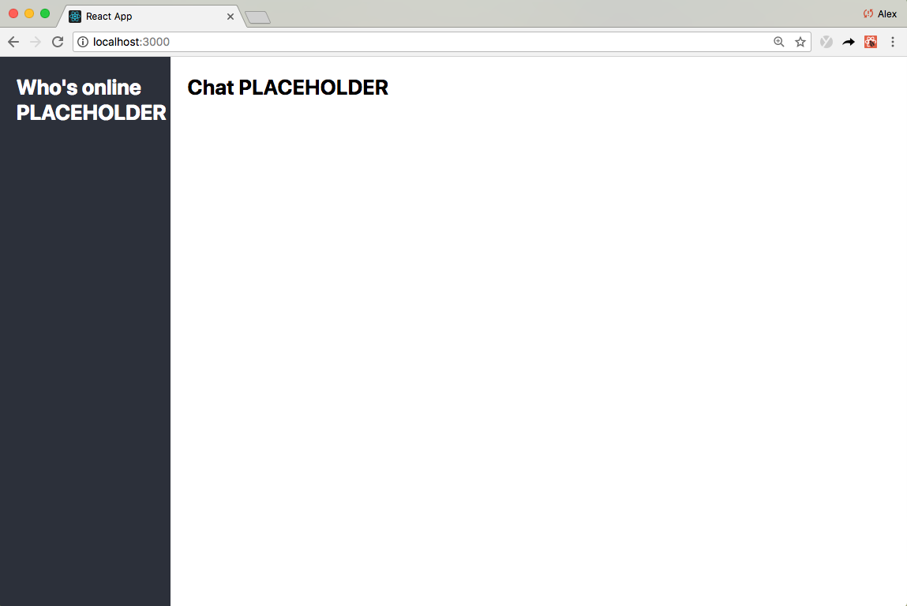

# Build a Slack Clone with React and Pusher Chatkit

[![Star on GitHub][github-star-badge]][github-star]

[github-star-badge]: https://img.shields.io/github/stars/pusher/build-a-slack-clone-with-react-and-pusher-chatkit.svg?style=social
[github-star]: https://github.com/pusher/build-a-slack-clone-with-react-and-pusher-chatkit/stargazers

In this tutorial, you’ll learn how to build a chat app with React and [Chatkit](https://pusher.com/chatkit?utm_source=github&utm_campaign=build-a-slack-clone-with-react-and-pusher-chatkit).

When we're done, we'll have a chat application complete with **typing indicators**, a **"who's online" list**, and **message history**:



If you think this sounds like a lot to tackle in one tutorial, you'd normally be right!

However, because we'll be using [Chatkit](https://pusher.com/chatkit?utm_source=github&utm_campaign=build-a-slack-clone-with-react-and-pusher-chatkit), we can more or less focus exclusively on the front-end React code while Chatkit does the heavy lifting.

## What is Chatkit?

[Chatkit](https://pusher.com/chatkit?utm_source=github&utm_campaign=build-a-slack-clone-with-react-and-pusher-chatkit) is a hosted API that helps you build impressive chat features into your applications with less code. Features like,

* Group chat
* One-to-one chat
* Private chat
* Typing indicators
* "Who's online" presence
* Read receipts
* Photo, video, and audio messages

Using our cross-platform SDKs, all chat data is sent to our hosted API where we manage chat state and broadcast it to your clients:


You'll never have to worry about scale or infrastructure, we take care of it all for you.

Perhaps the best way to learn Chatkit is to start building, so I highly recommend you follow along. Along the way, you'll learn best practices when using Chatkit with React.

## Steps

This tutorial has been written so that you can follow along, step by step. There are **12** steps in total.

Here's a quick rundown so you know what to expect:

1. [Download the React starter template](#step-1-download-the-react-starter-template)
2. [Create your own Chatkit instance](#step-2-create-your-own-chatkit-instance)
3. [Setup a basic Node server](#step-3-setup-a-basic-node-server)
4. [Identifying the user](#step-4-identifying-the-user)
5. [Render the chat screen](#step-5-render-the-chat-screen)
6. [Connect to your Chatkit instance](#step-6-connect-to-your-chatkit-instance)
7. [Create a Chatkit room](#step-7-create-a-chatkit-room)
8. [Create a basic UI layout](#step-8-create-a-basic-ui-layout)
9. [Subscribe to new messages](#step-9-subscribe-to-new-messages)
10. [Sending messages](#step-10-sending-messages)
11. [Add realtime typing indicators](#step-11-add-realtime-typing-indicators)
12. [Add a "Who's online" list](#step-12-add-a-whos-online-list)

Alright, let's code!

## Step 1. Download the React starter template

Rather than start from absolute scratch, this walkthrough is based on a minimal starter template:



As you can see, the starter template doesn't contain any interesting logic - just boilerplate we need to run a React application and a simple Node server.

> **"Server? No one mentioned a server!"**
>
> If you're not too familiar with [Node](https://nodejs.org/en/), don't worry 😊. After the next section, we won't need to touch the server.

To get started, download the starter template then run `npm install`:

```
git clone https://github.com/pusher/build-a-slack-clone-with-react-and-pusher-chatkit chatkit-tutorial
cd chatkit-tutorial
npm install
```

(Note: To see the completed code, you can [view the `completed` branch](https://github.com/pusher/build-a-slack-clone-with-react-and-pusher-chatkit/tree/complete) or run `git checkout complete` locally.)

(Also note: This tutorial assumes the use of `npm`, but the equivalent `yarn` commands will work as well.)

## Step 2. Create your own Chatkit instance

Now you've downloaded the starter template, let's create a Chatkit instance.

To create your own Chatkit instance, [head to the dashboard](https://dash.pusher.com/?utm_source=github&utm_campaign=build-a-slack-clone-with-react-and-pusher-chatkit) and hit **Create new**:



Give your instance any name (I called mine "React Chat Tutorial") then take note of your **Instance Locator** and **Secret Key** in the **Keys** tab. We'll need them both in the next section.


## Step 3. Setup a basic Node server

While most interactions will happen on the client, Chatkit also needs a server counterpart to create and manage users securely:



We won't authenticate users in this tutorial, but we'll still need to define a route that, when called, creates a Chatkit user.

Start by installing [`@pusher/chatkit-server`](https://www.npmjs.com/package/@pusher/chatkit-server):

```
npm install --save @pusher/chatkit-server
```

Then update `./server.js`:

```diff
const express = require('express')
const bodyParser = require('body-parser')
const cors = require('cors')
+const Chatkit = require('@pusher/chatkit-server')

const app = express()

+const chatkit = new Chatkit.default({
+  instanceLocator: 'YOUR INSTANCE LOCATOR',
+  key: 'YOUR KEY',
+})

app.use(bodyParser.urlencoded({ extended: false }))
app.use(bodyParser.json())
app.use(cors())

+app.post('/users', (req, res) => {
+  const { username } = req.body
+  chatkit
+    .createUser({
+      id: username,
+      name: username
+    })
+    .then(() => res.sendStatus(201))
+    .catch(error => {
+      if (error.error === 'services/chatkit/user_already_exists') {
+        res.sendStatus(200)
+      } else {
+        res.status(error.status).json(error)
+      }
+    })
+})

+app.post('/authenticate', (req, res) => {
+  const authData = chatkit.authenticate({ userId: req.query.user_id })
+  res.status(authData.status).send(authData.body)
+})


const PORT = 3001
app.listen(PORT, err => {
  if (err) {
    console.error(err)
  } else {
    console.log(`Running on port ${PORT}`)
  }
})
```

Remember to replace **"YOUR INSTANCE LOCATOR"** and **"YOUR KEY"** with your own respective values.

There's a lot to unpack here, starting from the top:

* First, we import `Chatkit` from `@pusher/chatkit-server`
* Then, instantiate our own `chatkit` instance using the **Instance Locator** and **Key** we noted in the previous step
* In the `/users` route, we take a `username` and create a Chatkit user through our `chatkit` instance
* Authentication is the action of proving a user is who she says she is. When someone first connects to Chatkit, a request will be sent to `/authenticate` to authenticate them. The server needs to respond with a token (returned by `chatkit.authenticate`) if the request is valid. In our case, we'll - naïvely - assume that everyone is who they say they are, and return a token from `chatkit.authenticate` no matter what.

Boom 💥! That's all we need to do on the server. Let's move on to the client...

## Step 4. Identifying the user

When someone loads the app, we want to ask them who they are.

Once they hit **Submit**, we'll send their username to the server (to the `/users` route we just defined) and create a Chatkit user if one doesn't exist.

To collect the user's name, create a component called `UsernameForm.js` in in `./src/components/`:

```diff
+import React, { Component } from 'react'

+class UsernameForm extends Component {
+ constructor(props) {
+   super(props)
+   this.state = {
+     username: '',
+   }
+   this.onSubmit = this.onSubmit.bind(this)
+   this.onChange = this.onChange.bind(this)
+ }

+ onSubmit(e) {
+   e.preventDefault()
+   this.props.onSubmit(this.state.username)
+ }

+ onChange(e) {
+    this.setState({ username: e.target.value })
+  }
+
+  render() {
+    return (
+      <div>
+        <div>
+          <h2>What is your username?</h2>
+          <form onSubmit={this.onSubmit}>
+            <input
+              type="text"
+              placeholder="Your full name"
+              onChange={this.onChange}
+            />
+            <input type="submit" />
+          </form>
+        </div>
+      </div>
+    )
+  }
+}
+
+ export default UsernameForm
```

Then update `App.js`:

```diff
import React, { Component } from 'react'
+import UsernameForm from './components/UsernameForm'

class App extends Component {
+  constructor() {
+    super()
+    this.state = {
+      currentUsername: '',
+    }
+    this.onUsernameSubmitted = this.onUsernameSubmitted.bind(this)
+  }

+  onUsernameSubmitted(username) {
+    fetch('http://localhost:3001/users', {
+      method: 'POST',
+      headers: {
+        'Content-Type': 'application/json',
+      },
+      body: JSON.stringify({ username }),
+    })
+      .then(response => {
+        this.setState({
+          currentUsername: username
+        })
+      })
+      .catch(error => console.error('error', error))
+  }

  render() {
-   return <h1>Chatly</h1>
+   return <UsernameForm onSubmit={this.onUsernameSubmitted} />
  }
}

export default App
```

Run the application using `npm start` and you'll see that the screen is rendered:



Starting from the top of `App.js`:

* First, we import the `UsernameForm` component. It probably looks familiar to you because it uses a common React pattern called controlled components. You can read more about  React forms [here](https://reactjs.org/docs/forms.html)
* In the `render` function we render the `UsernameForm` and hook up the `onUsernameSubmitted` event handler
* When `onUsernameSubmitted` is called, we send a POST request to the `/users` route we just defined. If the request is successful, we update `this.state.currentUsername` so we can reference it later; otherwise, we `console.error` the error


## Step 5. Render the chat screen

At the moment, we render the `UsernameForm` and it occupies the entire screen (see the above screenshot).

Once the username has been submitted, we'll want to transition to a different screen - namely, the chat screen.

To do that, we first need to create a `ChatScreen.js` component in `./src`:


```diff
+import React, { Component } from 'react'
+
+class ChatScreen extends Component {
+  render() {
+    return (
+      <div>
+        <h1>Chat</h1>
+      </div>
+    )
+  }
+}
+
+export default ChatScreen
```

Then update `App.js`:

```diff
import React, { Component } from 'react'
import UsernameForm from './components/UsernameForm'
+import ChatScreen from './ChatScreen'

class App extends Component {
  constructor() {
    super()
    this.state = {
      currentUsername: '',
+     currentScreen: 'WhatIsYourUsernameScreen'
    }
    this.onUsernameSubmitted = this.onUsernameSubmitted.bind(this)
 }

  onUsernameSubmitted(username) {
    fetch('http://localhost:3001/users', {
      method: 'POST',
      headers: {
        'Content-Type': 'application/json',
      },
      body: JSON.stringify({ username }),
    })
      .then(response => {
        this.setState({
          currentUsername: username,
+         currentScreen: 'ChatScreen'
        })
      })
      .catch(error => console.error('error', error))
  }

 render() {
+    if (this.state.currentScreen === 'WhatIsYourUsernameScreen') {
      return <UsernameForm onSubmit={this.onUsernameSubmitted} />
+    }
+    if (this.state.currentScreen === 'ChatScreen') {
+      return <ChatScreen currentUsername={this.state.currentUsername} />
+    }
  }
}

export default App
```

Rather than use a router, we conditionally render the screen based on `this.state.currentScreen`.

## Step 6. Connect to your Chatkit instance

Earlier, we installed `@pusher/chatkit-server`. Now we're in client-land, you'll need to install [`@pusher/chatkit-client`](https://www.npmjs.com/package/@pusher/chatkit-client) as well:

```
npm install --save @pusher/chatkit-client
```

Then update `ChatScreen.js`:

```diff
import React, { Component } from 'react'
+import Chatkit from '@pusher/chatkit-client'

class ChatScreen extends Component {
+  constructor(props) {
+    super(props)
+    this.state = {
+      currentUser: {}
+    }
+  }

+  componentDidMount () {
+    const chatManager = new Chatkit.ChatManager({
+      instanceLocator: 'YOUR INSTANCE LOCATOR',
+      userId: this.props.currentUsername,
+      tokenProvider: new Chatkit.TokenProvider({
+        url: 'http://localhost:3001/authenticate',
+      }),
+    })
+
+    chatManager
+      .connect()
+      .then(currentUser => {
+        this.setState({ currentUser })
+     })
+     .catch(error => console.error('error', error))
+  }

  render() {
    return (
      <div>
        <h1>Chat</h1>
      </div>
    )
  }
}

export default ChatScreen
```

Remember to replace **"YOUR INSTANCE LOCATOR"** with yours that you noted earlier.

Again, starting from the top:

* First, we import `Chatkit`
* Then, instantiate our Chatkit `ChatManager` with our `instanceLocator`, `userId` (from `this.props.currentUsername`), and a custom `TokenProvider`. The `TokenProvider` points to the `/authenticate` route we defined earlier
* Once `ChatManager` has been initialised, we can call `connect`. `connect` happens asynchronously and a [`Promise`](https://developers.google.com/web/fundamentals/primers/promises) is returned. If you've followed these steps exactly, you will connect. That being said, watch out for any `console.error`s in case you missed something

## Step 7. Create a Chatkit room

When using Chatkit, all messages are sent to a Chatkit room.

Rooms can be created programmatically (on the server or client using `createRoom`), or in the dashboard Inspector.

Creating rooms from the Inspector isn't really a good practice (it's mainly intended for testing) but for the purpose of this walkthrough, we'll do it anyway.

In the dashboard, head to the **Console** tab, where you'll find the Inspector and create a user with any name. I will call mine "Admin".

Then, create a room called "General":



It is really important to note the unique **Room id** highlighted above.

## Step 8. Create a basic UI layout

This step marks a significant point in the walkthrough.

Now we have our boilerplate in place, we can rapidly start to build out chat features.

Going forward, we'll break down each feature into independent (reusable, if you want!) React components:



We will create each component as we go along, but to make the tutorial a bit easier to follow, let's set out the basic component UI layout now:

```diff
import React, { Component } from 'react'
import Chatkit from '@pusher/chatkit-client'

class ChatScreen extends Component {
  constructor(props) {
    super(props)
    this.state = {
      currentUser: {}
    }
  }

  componentDidMount () {
    const chatManager = new Chatkit.ChatManager({
      instanceLocator: 'YOUR INSTANCE LOCATOR',
      userId: this.props.currentUsername,
      tokenProvider: new Chatkit.TokenProvider({
        url: 'http://localhost:3001/authenticate',
      }),
    })

    chatManager
      .connect()
      .then(currentUser => {
        this.setState({ currentUser })
      })
      .catch(error => console.error('error', error))
  }

  render() {
-    return (
-      <div>
-        <h1>Chat</h1>
-      </div>
-    )
+    const styles = {
+      container: {
+        height: '100vh',
+        display: 'flex',
+        flexDirection: 'column',
+      },
+      chatContainer: {
+        display: 'flex',
+        flex: 1,
+      },
+      whosOnlineListContainer: {
+        width: '300px',
+        flex: 'none',
+        padding: 20,
+        backgroundColor: '#2c303b',
+        color: 'white',
+      },
+      chatListContainer: {
+        padding: 20,
+        width: '85%',
+        display: 'flex',
+        flexDirection: 'column',
+      },
+   }

+    return (
+      <div style={styles.container}>
+        <div style={styles.chatContainer}>
+          <aside style={styles.whosOnlineListContainer}>
+            <h2>Who's online PLACEHOLDER</h2>
+          </aside>
+          <section style={styles.chatListContainer}>
+            <h2>Chat PLACEHOLDER</h2>
+          </section>
+        </div>
+      </div>
+    )
  }
}

export default ChatScreen
```

If you run the app now, you'll see the basic layout take place:



Awesome!

## Step 9. Subscribe to new messages

I am really excited to show you this!

Now we have a `Chatkit` connection, building chat features become as simple as hooking up Chatkit events to UI components. Here, let me show you.

First, create a stateless `MessageList.js` component in `./src/components`:


```diff
+ import React, { Component } from 'react'
+
+ class MessagesList extends Component {
+   render() {
+     const styles = {
+       container: {
+         overflowY: 'scroll',
+         flex: 1,
+       },
+       ul: {
+         listStyle: 'none',
+       },
+       li: {
+         marginTop: 13,
+         marginBottom: 13,
+       },
+       senderUsername: {
+         fontWeight: 'bold',
+       },
+       message: { fontSize: 15 },
+     }
+     return (
+       <div
+         style={{
+           ...this.props.style,
+           ...styles.container,
+         }}
+       >
+         <ul style={styles.ul}>
+           {this.props.messages.map((message, index) => (
+             <li key={index} style={styles.li}>
+               <div>
+                 <span style={styles.senderUsername}>{message.senderId}</span>{' '}
+               </div>
+               <p style={styles.message}>{message.text}</p>
+             </li>
+           ))}
+         </ul>
+       </div>
+     )
+   }
+ }
+
+ export default MessagesList
```

Then update `ChatScreen.js`:

```diff
import React, { Component } from 'react'
import Chatkit from '@pusher/chatkit-client'
+import MessageList from './components/MessageList'


class ChatScreen extends Component {
  constructor(props) {
    super(props)
    this.state = {
      currentUser: {},
+     currentRoom: {},
+     messages: []
    }
  }

  componentDidMount () {
    const chatManager = new Chatkit.ChatManager({
      instanceLocator: 'YOUR INSTANCE LOCATOR',
      userId: this.props.currentUsername,
      tokenProvider: new Chatkit.TokenProvider({
        url: 'http://localhost:3001/authenticate',
      }),
    })

    chatManager
      .connect()
      .then(currentUser => {
        this.setState({ currentUser })
+        return currentUser.subscribeToRoom({
+          roomId: "YOUR ROOM ID",
+          messageLimit: 100,
+          hooks: {
+            onMessage: message => {
+              this.setState({
+                messages: [...this.state.messages, message],
+              })
+            },
+          },
+        })
+      })
+      .then(currentRoom => {
+        this.setState({ currentRoom })
+       })
      .catch(error => console.error('error', error))
  }

  render() {
    const styles = {
      ...
    }
    return (
      <div style={styles.container}>
        <div style={styles.chatContainer}>
          <aside style={styles.whosOnlineListContainer}>
            <h2>Who's online PLACEHOLDER</h2>
          </aside>
          <section style={styles.chatListContainer}>
-            <h2>Chat PLACEHOLDER</h2>
+            <MessageList
+              messages={this.state.messages}
+              style={styles.chatList}
+            />
          </section>
        </div>
      </div>
    )
  }
}

export default ChatScreen
```

Remember to replace **YOUR ROOM ID** with your own room ID that you noted earlier.

Let's break it down:

* Once you connect to Chatkit you get a `currentUser` object that represents the current connected user
* Chatkit is "user-driven" meaning that most if not all interactions happen on the `currentUser`
* In this case, we call `subscribeToRoom` on the `currentUser` (`currentUser.subscribeToRoom`)
* `subscribeToRoom` takes an event handler called `onMessage` that is called in real-time each time a new message arrives
* Because we specified the `messageLimit` to be `100`, `onMessage` is also called _retroactively_ for up to `100` most recent messages. In practice, this means if you refresh the page you'll see up to `100` of the most recent chat messages
* There is a fair amount of code here but once you break it down, all we're doing is taking new messages and updating the React state - the significant chat-related code couldn't be more minimal

## Step 10. Sending messages

We're on a roll!

Next, let's allow users to send messages by first creating a `SendMessageForm.js` component in `./src/components`:

```diff
+ import React, { Component } from 'react'
+
+ class SendMessageForm extends Component {
+   constructor(props) {
+     super(props)
+     this.state = {
+       text: '',
+     }
+     this.onSubmit = this.onSubmit.bind(this)
+     this.onChange = this.onChange.bind(this)
+   }
+
+   onSubmit(e) {
+     e.preventDefault()
+     this.props.onSubmit(this.state.text)
+     this.setState({ text: '' })
+   }
+
+   onChange(e) {
+     this.setState({ text: e.target.value })
+     if (this.props.onChange) {
+       this.props.onChange()
+     }
+   }
+
+   render() {
+     const styles = {
+       container: {
+         padding: 20,
+         borderTop: '1px #4C758F solid',
+         marginBottom: 20,
+       },
+       form: {
+         display: 'flex',
+       },
+       input: {
+         color: 'inherit',
+         background: 'none',
+         outline: 'none',
+         border: 'none',
+         flex: 1,
+         fontSize: 16,
+       },
+     }
+     return (
+       <div style={styles.container}>
+         <div>
+           <form onSubmit={this.onSubmit} style={styles.form}>
+             <input
+               type="text"
+               placeholder="Type a message here then hit ENTER"
+               onChange={this.onChange}
+               value={this.state.text}
+               style={styles.input}
+             />
+           </form>
+         </div>
+       </div>
+     )
+   }
+ }
+
+ export default SendMessageForm
```

Then - you guessed it - update `ChatScreen.js`:

```diff
import React, { Component } from 'react'
import Chatkit from '@pusher/chatkit-client'
import MessageList from './components/MessageList'
+ import SendMessageForm from './components/SendMessageForm'

class ChatScreen extends Component {
  constructor(props) {
    super(props)
    this.state = {
      currentUser: {},
      currentRoom: {},
      messages: []
    }
+    this.sendMessage = this.sendMessage.bind(this)
  }


+  sendMessage(text) {
+    this.state.currentUser.sendMessage({
+      text,
+      roomId: this.state.currentRoom.id,
+    })
+  }

 componentDidMount () {
    const chatManager = new Chatkit.ChatManager({
      instanceLocator: 'YOUR INSTANCE LOCATOR',
      userId: this.props.currentUsername,
      tokenProvider: new Chatkit.TokenProvider({
        url: 'http://localhost:3001/authenticate',
      }),
    })

    chatManager
      .connect()
      .then(currentUser => {
        this.setState({ currentUser })
        return currentUser.subscribeToRoom({
          roomId: YOUR ROOM ID,
          messageLimit: 100,
          hooks: {
            onMessage: message => {
              this.setState({
                messages: [...this.state.messages, message],
              })
            },
          },
        })
      })
      .then(currentRoom => {
        this.setState({ currentRoom })
       })
      .catch(error => console.error('error', error))
  }


  render() {
    const styles = {
     ...
    }
    return (
      <div style={styles.container}>
        <div style={styles.chatContainer}>
          <aside style={styles.whosOnlineListContainer}>
            <h2>Who's online PLACEHOLDER</h2>
          </aside>
          <section style={styles.chatListContainer}>
            <MessageList
              messages={this.state.messages}
              style={styles.chatList}
            />
+           <SendMessageForm onSubmit={this.sendMessage} />
          </section>
        </div>
      </div>
    )
  }
}

export default ChatScreen
```


The `SendMessageForm` component is essentially the same as  the`WhatIsYourUsernameForm` component we defined earlier.

When the `SendMessageForm` is submitted, we access `this.state.currentUser` and call `sendMessage` (remember, most interactions happen on `currentUser`)

You can probably see a pattern emerging...

`ChatScreen` is a _container component_ that manages our application state and renders the UI using presentational - normally stateless - components. Most of our code involves hooking up Chatkit events and their associated data to React UI components.

## Step 11. Add realtime typing indicators

If you've ever attempted to implement your own typing indicators, you'll know it can be tricky. In general, more real-time features means more data and more connections to manage.

With Chatkit, you can add typing indicators with little effort.

Start by creating a  `TypingIndicator.js` component in `./src/components`:

```diff
+import React, { Component } from 'react'
+
+class TypingIndicator extends Component {
+  render() {
+    if (this.props.usersWhoAreTyping.length > 0) {
+      return (
+        <div>
+          {`${this.props.usersWhoAreTyping
+            .slice(0, 2)
+            .join(' and ')} is typing`}
+        </div>
+      )
+    }
+    return <div />
+  }
+}
+
+export default TypingIndicator
```

Then update `ChatScreen.js`:

```diff
import React, { Component } from 'react'
import Chatkit from '@pusher/chatkit-client'
import MessageList from './components/MessageList'
import SendMessageForm from './components/SendMessageForm'
+import TypingIndicator from './components/TypingIndicator'

class ChatScreen extends Component {
  constructor(props) {
    super(props)
    this.state = {
      currentUser: {},
      currentRoom: {},
      messages: [],
+     usersWhoAreTyping: [],
    }
    this.sendMessage = this.sendMessage.bind(this)
+   this.sendTypingEvent = this.sendTypingEvent.bind(this)
  }

+  sendTypingEvent() {
+    this.state.currentUser
+      .isTypingIn({ roomId: this.state.currentRoom.id })
+      .catch(error => console.error('error', error))
+  }

  sendMessage(text) {
    this.state.currentUser.sendMessage({
      text,
      roomId: this.state.currentRoom.id,
    })
  }

  componentDidMount() {
    const chatManager = new Chatkit.ChatManager({
      instanceLocator: 'YOUR INSTANCE LOCATOR',
      userId: this.props.currentUsername,
      tokenProvider: new Chatkit.TokenProvider({
        url: 'http://localhost:3001/authenticate',
      }),
    })

    chatManager
      .connect()
      .then(currentUser => {
        this.setState({ currentUser })
        return currentUser.subscribeToRoom({
          roomId: YOUR ROOM ID,
          messageLimit: 100,
          hooks: {
            onMessage: message => {
              this.setState({
                messages: [...this.state.messages, message],
              })
            },
+            onUserStartedTyping: user => {
+              this.setState({
+                usersWhoAreTyping: [...this.state.usersWhoAreTyping, user.name],
+             })
+            },
+            onUserStoppedTyping: user => {
+              this.setState({
+                usersWhoAreTyping: this.state.usersWhoAreTyping.filter(
+                  username => username !== user.name
+                ),
+              })
+            },
          },
        })
      })
      .then(currentRoom => {
        this.setState({ currentRoom })
      })
      .catch(error => console.error('error', error))
  }

  render() {
    const styles = {
      ...
    }
    return (
      <div style={styles.container}>>
        <div style={styles.chatContainer}>
          <aside style={styles.whosOnlineListContainer}>
            <h2>Who's online PLACEHOLDER</h2>
          </aside>
          <section style={styles.chatListContainer}>
            <MessageList
              messages={this.state.messages}
              style={styles.chatList}
            />
+           <TypingIndicator usersWhoAreTyping={this.state.usersWhoAreTyping} />
            <SendMessageForm
              onSubmit={this.sendMessage}
+             onChange={this.sendTypingEvent}
            />
          </section>
        </div>
      </div>
    )
  }
}

export default ChatScreen
```

When using Chatkit, typing indicators boil down to two fundamental actions:

* Calling `currentUser.userIsTyping` when the current user starts typing; then,
* listening to `userStartedTyping` and `userStoppedTyping` events

And that is pretty much it.

_"But Alex, what about when the user _stops_ typing?"_

That is a very good question.

Chatkit is intelligent like that. If the service doesn't receive a `userIsTyping` event after a few seconds, it assumes the `currentUser` has stopped typing. Therefore, there is no need to manually raise an event when someone stops typing. Pretty slick, right?


## Step 12. Add a "Who's online" list

Can you feel the momentum? Almost done now 🙌

To finish up the chat app, let's use Chatkit's "who's online" feature to render a list of users and their real-time online status.

Start by creating a `WhosOnlineList.js` component in `/src/components`:

```diff
+import React, { Component } from 'react'
+
+class WhosOnlineList extends Component {
+  renderUsers() {
+    return (
+      <ul>
+        {this.props.users.map((user, index) => {
+          if (user.id === this.props.currentUser.id) {
+            return (
+              <WhosOnlineListItem key={index} presenceState="online">
+                {user.name} (You)
+              </WhosOnlineListItem>
+            )
+          }
+          return (
+            <WhosOnlineListItem key={index} presenceState={user.presence.state}>
+              {user.name}
+            </WhosOnlineListItem>
+          )
+        })}
+      </ul>
+    )
+  }
+
+  render() {
+    if (this.props.users) {
+      return this.renderUsers()
+    } else {
+      return <p>Loading...</p>
+    }
+  }
+}
+
+class WhosOnlineListItem extends Component {
+  render() {
+    const styles = {
+      li: {
+        display: 'flex',
+        alignItems: 'center',
+        marginTop: 5,
+        marginBottom: 5,
+        paddingTop: 2,
+        paddingBottom: 2,
+      },
+      div: {
+        borderRadius: '50%',
+        width: 11,
+        height: 11,
+        marginRight: 10,
+      },
+    }
+    return (
+      <li style={styles.li}>
+        <div
+          style={{
+            ...styles.div,
+            backgroundColor:
+              this.props.presenceState === 'online' ? '#539eff' : '#414756',
+          }}
+        />
+        {this.props.children}
+      </li>
+    )
+  }
+}
+
+export default WhosOnlineList
```

Then - for the last time 😢👋 - update `ChatScreen.js`:


```diff
import React, { Component } from 'react'
import Chatkit from '@pusher/chatkit-client'
import MessageList from './components/MessageList'
import SendMessageForm from './components/SendMessageForm'
import TypingIndicator from './components/TypingIndicator'
+import WhosOnlineList from './components/WhosOnlineList'

class ChatScreen extends Component {
  constructor(props) {
    super(props)
    this.state = {
      currentUser: {},
      currentRoom: {},
      messages: [],
      usersWhoAreTyping: [],
    }
    this.sendMessage = this.sendMessage.bind(this)
    this.sendTypingEvent = this.sendTypingEvent.bind(this)
  }

  sendTypingEvent() {
    this.state.currentUser
      .isTypingIn(this.state.currentRoom.id)
      .catch(error => console.error('error', error))
  }

   sendMessage(text) {
    this.state.currentUser.sendMessage({
      text,
      roomId: this.state.currentRoom.id,
    })
  }

  comonentDidMount() {
    const chatManager = new Chatkit.ChatManager({
      instanceLocator: 'YOUR INSTANCE LOCATOR',
      userId: this.props.currentUsername,
      tokenProvider: new Chatkit.TokenProvider({
        url: 'http://localhost:3001/authenticate',
      }),
    })

    chatManager
      .connect()
      .then(currentUser => {
        this.setState({ currentUser })
        return currentUser.subscribeToRoom({
          roomId: YOUR ROOM ID,
          messageLimit: 100,
          hooks: {
            newMessage: message => {
              this.setState({
                messages: [...this.state.messages, message],
              })
            },
            userStartedTyping: user => {
              this.setState({
                usersWhoAreTyping: [...this.state.usersWhoAreTyping, user.name],
              })
            },
            userStoppedTyping: user => {
              this.setState({
                usersWhoAreTyping: this.state.usersWhoAreTyping.filter(
                  username => username !== user.name
                ),
              })
            },
+            onPresenceChange: () => this.forceUpdate(),
          },
        })
      })
      .then(currentRoom => {
        this.setState({ currentRoom })
      })
      .catch(error => console.error('error', error))
  }

  render() {
    const styles = {
      ...
    }
    return (
      <div style={styles.container}>
        <header style={styles.header}>
          <h2>Chatly</h2>
        </header>
        <div style={styles.chatContainer}>
          <aside style={styles.whosOnlineListContainer}>
-            <h2>Who's online PLACEHOLDER</h2>
+            <WhosOnlineList
+              currentUser={this.state.currentUser}
+              users={this.state.currentRoom.users}
+            />
          </aside>
          <section style={styles.chatListContainer}>
            <MessageList
              messages={this.state.messages}
              style={styles.chatList}
            />
            <TypingIndicator usersWhoAreTyping={this.state.usersWhoAreTyping} />
            <SendMessageForm
              onSubmit={this.sendMessage}
              onChange={this.sendTypingEvent}
            />
          </section>
        </div>
      </div>
    )
  }
}

export default ChatScreen
```

Managing the state of your users in  React state can be a bit tricky so we manage it for you in `currentRoom.users`.

As users connect and disconnect, this property is dynamically updated. In other words, `currentRoom.users` should always refelect the current state of your chat app.

Therefore, when users come online or go offline (`onPresenceChange`), or new users join (`onUserAdded`) all we have to do is call `forceUpdate` which tells React to evaluate `currentRoom.users` and update the UI.

Again, it really boils down to wiring some simple data and events to React components and that's all, folks!

## Conclusion

In this walkthrough, you built a complete chat application with

* group chat;
* a “Who’s online” list; and,
* typing indicators

Because we used Chatkit, we also get some bonus features for free:

* message history (refresh the page and you’ll see up to 100 of the most recent messages);
* reliability in the case that the client temporarily loses connection (Chatkit handles disconnects gracefully); and,
* the ability to scale without needing to worry about infrastructure

We wrote a fair amount of code, but none of it was particularly complicated.

Chatkit has a minimal but powerful API that manages all our chat data for us. All we had to do is take that data and render it for the user.

Want to keep building? Why not add rich media support and read receipts? Chatkit supports both:

* [Read receipts](https://docs.pusher.com/chatkit/reference/javascript#cursors)
* [File API](https://docs.pusher.com/chatkit/reference/javascript#attachment)

You may also be interested in checking out [our powerful Chatkit Slack demo](https://github.com/pusher/react-slack-clone) ([250+ stars ⭐️](https://github.com/pusher/react-slack-clone/stargazers)). It’s similar to the application we just built but more complete.

**What will you build with Chatkit? We'd love to see! Your feedback guides us in improving Chatkit. Let us know what helps you reach your goals, what’s getting in your way, or what’s missing.**
